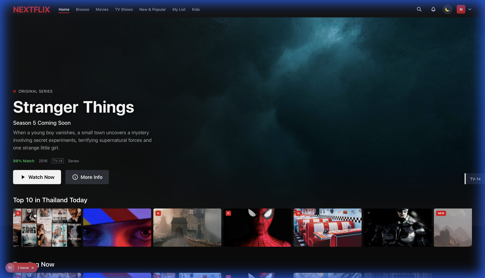
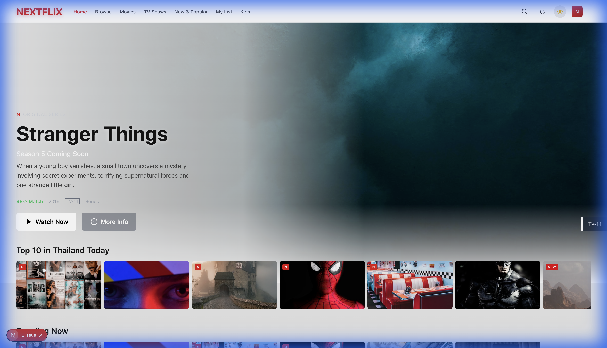

<div align="center">

# 🎬 Nextflix

### Netflix Clone - Full-featured Streaming Service Web App

[](https://nextjs.org/)
[](https://www.typescriptlang.org/)
[](https://tailwindcss.com/)
[](https://supabase.com/)
[](LICENSE)

[]()
[]()
[]()

**Netflix-style streaming platform built with Next.js & Clean Architecture**

[Demo](#-demo) • [Features](#-features) • [Installation](#-installation) • [Tech Stack](#-tech-stack) • [Architecture](#-architecture)

</div>

---

## 📸 Screenshots

### 🌙 Dark Theme (Default)
<div align="center">

<p><em>Dark mode with Netflix-style glassmorphism and gradient overlays</em></p>
</div>

### ☀️ Light Theme
<div align="center">

<p><em>Light mode with clean, bright UI and adjusted contrast</em></p>
</div>

---

## ✨ Features

### 🎨 Dual Layout System
- **Modern Layout** - Netflix-style glassmorphism, smooth animations
- **Retro Layout** - Windows 98 / IE5 aesthetic (nostalgic mode)

### 🎬 Core Features
- 🏠 **Home Page** - Hero section with featured content
- 📺 **Browse** - Genre filtering and content discovery
- 🔍 **Search** - Real-time content search
- 📋 **My List** - Personal watchlist
- 👤 **Profiles** - Multiple user profiles
- ▶️ **Video Player** - Custom player UI (planned)

### 🎨 UI Components
- Content Cards with hover preview animation
- Horizontal scroll content rows
- Modal with keyboard support
- Animated buttons and inputs
- Responsive design

### 🛠️ Developer Experience
- ⚡ Next.js 16 App Router
- 🎯 Clean Architecture pattern
- 🔄 SSR with initial data hydration
- 📱 Mobile-first responsive design

---

## 🚀 Installation

```bash
# Clone the repository
git clone https://github.com/yourusername/nextflix-nextjs.git

# Navigate to directory
cd nextflix-nextjs

# Install dependencies
yarn install

# Copy environment variables
cp .env.example .env.local

# Run development server
yarn dev
```

Open [http://localhost:3000](http://localhost:3000) in your browser.

---

## 🛠️ Tech Stack

| Category | Technology |
|----------|------------|
| **Framework** | Next.js 16 (App Router) |
| **Language** | TypeScript |
| **Styling** | TailwindCSS v4 |
| **State** | Zustand |
| **Animations** | React Spring |
| **Forms** | React Hook Form + Zod |
| **Theme** | next-themes |
| **Database** | Supabase |
| **Auth** | Supabase Auth |

---

## 📐 Architecture

```
src/
├── domain/           # Business entities & types
│   └── entities/
│       └── types.ts
├── infrastructure/   # External services
│   ├── data/         # Mock data
│   └── repositories/ # Data access layer
│       └── mock/     # Mock repositories
└── presentation/     # UI layer
    ├── components/
    │   ├── common/   # Shared components
    │   ├── home/     # Home page components
    │   ├── layouts/  # Main & Retro layouts
    │   └── ui/       # Reusable UI components
    ├── presenters/   # Business logic
    └── providers/    # Context providers
```

### Design Patterns
- **Clean Architecture** - Separation of concerns
- **Presenter Pattern** - UI logic separated from components
- **Repository Pattern** - Data access abstraction

---

## 📁 Project Structure

```
nextflix-nextjs/
├── app/                    # Next.js App Router
│   ├── browse/             # Browse/Categories
│   ├── search/             # Search page
│   ├── watch/              # Video player
│   ├── my-list/            # Watchlist
│   ├── profiles/           # Profile selection
│   └── account/            # Account settings
├── public/
│   └── styles/             # CSS files
├── src/                    # Source code
├── supabase/               # Database migrations
└── docs/
    └── screenshots/        # Documentation images
```

---

## 🎯 Roadmap

### Phase 1: Foundation ✅
- [x] Theme Provider & Dark Mode
- [x] MainLayout (Netflix-style)
- [x] RetroLayout (Windows 98/IE5)
- [x] Reusable UI Components
- [x] Home Page with Hero Section

### Phase 2: Core Pages 🔄
- [ ] Browse/Categories Page
- [ ] Search Page
- [ ] Content Detail Page
- [ ] Video Player
- [ ] My List Page
- [ ] Profile Selection

### Phase 3: Authentication
- [ ] Login/Register Pages
- [ ] Supabase Auth Integration
- [ ] Protected Routes

### Phase 4: Features
- [ ] Continue Watching
- [ ] Recommendations Engine
- [ ] Ratings & Reviews
- [ ] Notifications

### Phase 5: Backend
- [ ] Supabase Database
- [ ] Real Data Migration
- [ ] API Routes

---

## 🔧 Development

```bash
# Start development server
yarn dev

# Build for production
yarn build

# Run linting
yarn lint

# Type checking
yarn tsc --noEmit
```

---

## 🤝 Contributing

Contributions are welcome! Please feel free to submit a Pull Request.

1. Fork the repository
2. Create your feature branch (`git checkout -b feature/amazing-feature`)
3. Commit your changes (`git commit -m 'Add amazing feature'`)
4. Push to the branch (`git push origin feature/amazing-feature`)
5. Open a Pull Request

---

## 📄 License

This project is licensed under the MIT License - see the [LICENSE](LICENSE) file for details.

---

<div align="center">

Made with ❤️ by [Nextflix Team](https://github.com/yourusername)

⭐ Star us on GitHub — it motivates us a lot!

</div>
